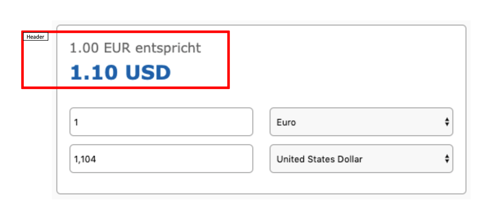

# Create a currency converter with React.

## Layout:
- Use MUI (https://mui.com/) for the layout
- The converter should roughly look like the layout (see image below)
- The header values should change if the user is changing the inputs or select boxes
- The header values have 2 decimal places and are separated by dot (eg.: 1.10 EUR)
- The input fields should only allow numbers and a comma (eg.: 1,104)
- The currency names in the select boxes should be sorted alphabetically

## Data and calculation:
You will need an API access key for the exchange rate api, so please request one here: https://exchangeratesapi.io/ (it's free).

- Fetch the currency names using:
   https://openexchangerates.org/api/currencies.json
- Fetch the exchange rates from:
   http://api.exchangeratesapi.io/v1/latest?access_key=<your_access_key>
- Exchange the entered amount using the exchange rates from the api. When one
   of the input/select fields changes, it should of course re-calculate.

## Testing
- Write at least one javascript unit test with your favorite testing framework.
- Full test coverage would be amazing, but is not required.

## Documentation
- Please include a readme with a short description of your solution.

## Bonus points (if you have time)
- Use Typescript
- Use Redux (even if it's an overkill for this task - we want to see how you use it)
- Add another page with a list of the last 10 conversions (use local storage to store the data)

